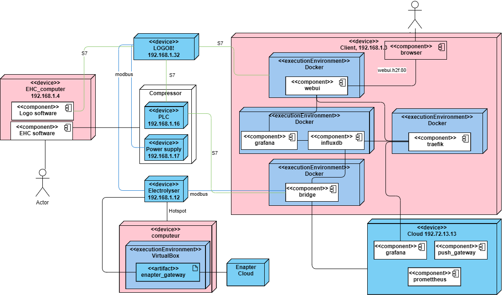
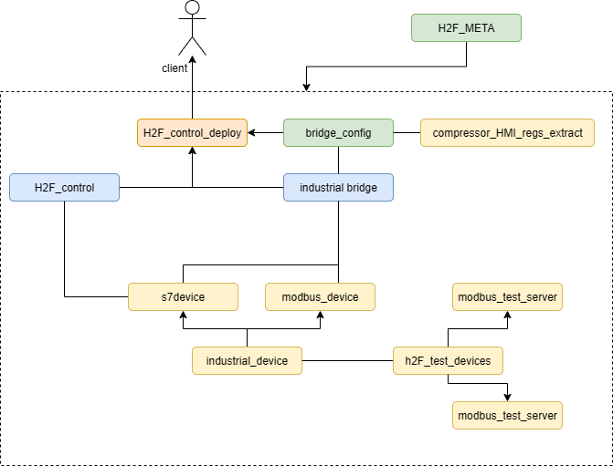
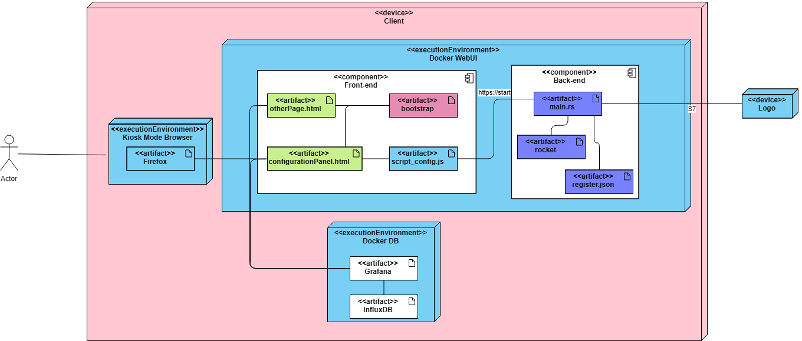
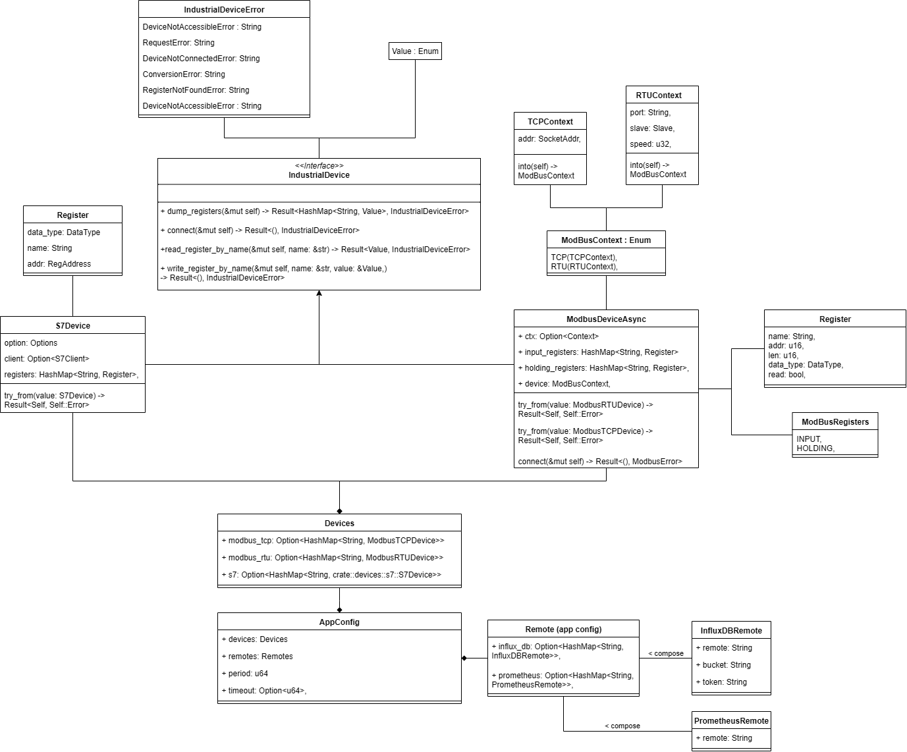
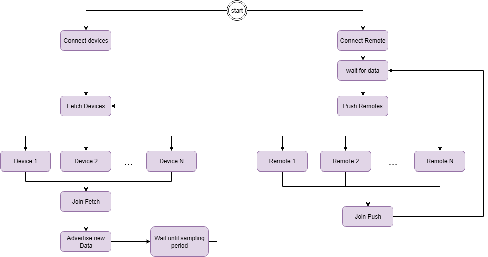
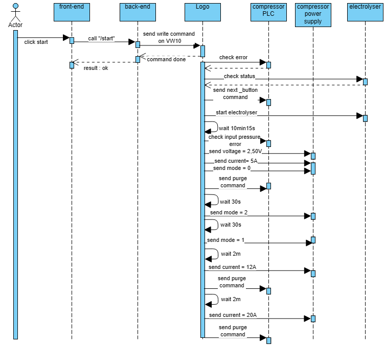

# Codebase

# Summary
- [List of Technololy](#list-of-technology) : All the technology of the project
- [Detailled architecture](#detailled-architecture) : The detail scheme of the whole infrastructure
- [Git Repositories](#git-repositories) : The simple relationship scheme between the repositories
- [Code architecture of the WebUI](#code-architecture-of-the-webui) : Represention of the organization of the code of the webUI
- [Diagramm Class](#diagramm-class) : Diagram class of the Bridge codebase
- [Database Description](#database-description) : description of the step to deploy the project
- [Simple Execution flow](#simple-execution-flow-bridge) : description of the step of the execution for the bridge
- [Simple Execution flow](#simple-execution-flow-webui) : description of the step of the execution for the webUI
- [Ansible Command](#ansible-command) : description of the step to deploy the project
- [Integrating new devices](#integrating-new-devices) : description of the step to deploy the project
- [Tips to apply modification](#tips-to-apply-modification) : description of the step to deploy the project

## List of technology
### Physical Device
- [Electrolyser](https://handbook.enapter.com/electrolyser/el41)
- [Logo](https://www.siemens.com/de/de/produkte/automatisierung/systeme/industrie/sps/logo/logo-basis-module.html)
- [EHC](https://hyethydrogen.com/hcs100)
### Virtualization
- [VirtualBox](https://www.virtualbox.org)
- [Docker](https://www.docker.com)
### DataBase
- [Grafana](https://grafana.com)
- [InfluxDB](https://www.influxdata.com)
- [Promettheus](https://prometheus.io)
- [Pushgateway](https://prometheus.io/docs/practices/pushing)
### Deployement Management
- [Traefik](https://traefik.io)
- [Ansible](https://docs.ansible.com)

### Programming Language
- [Rust](https://www.rust-lang.org)
- [Javascript](https://developer.mozilla.org/en/docs/Web/JavaScript)
- [HTML](https://developer.mozilla.org/en/docs/Web/HTML)
- [CSS](https://developer.mozilla.org/en/docs/Web/CSS)
- [Bootstrap](https://getbootstrap.com)
### Other technology
- [EnapterGateway](https://handbook.enapter.com/software/gateway_software)
- [Kiosk Mod](https://www.docker.com)

## Detailled architecture

This diagram represents the hardware and software architecture of an industrial system involving PLCs, an electrolyzer, and monitoring through Docker and Cloud services.

---

### 1. Physical Devices

| Device                  | IP Address     | Description / Components                                |
|--------------------------|---------------|--------------------------------------------------------|
| **EHC_computer**        | 192.168.1.4   | Runs *Logo software* and *EHC software*, used by the operator |
| **LOGO8!**              | 192.168.1.32  | Siemens LOGO! PLC, communicates via **S7** protocol    |
| **Compressor**          | —             | Includes **PLC (192.168.1.16)** and **Power supply (192.168.1.17)** |
| **Electrolyzer**        | 192.168.1.12  | Communicates via **Modbus** and connect with a **Hotspot**            |
| **Client**              | 192.168.1.5   | User machine with a browser, runs multiple Docker containers |
| **Cloud**               | 192.72.13.13  | Remote monitoring services (*Grafana, Push Gateway, Prometheus*) |
| **Local computer**      | —             | Runs **VirtualBox** with *enapter_gateway* connected to **Enapter Cloud** |

---

### 2. Software Environments

| Environment     | Hosted Components                                              |
|-----------------|----------------------------------------------------------------|
| **Docker**      | *webui*, *grafana*, *influxdb*, *traefik*, *bridge*            |
| **VirtualBox**  | *enapter_gateway* (bridge between electrolyser and **Enapter Cloud**)              |

---

### 3. Communication Protocols

| Protocol  | Purpose                                                         |
|-----------|-----------------------------------------------------------------|
| **S7**    | Communication between Siemens PLCs (LOGO! and Compressor PLC)   |
| **Modbus**| Communication with the Electrolyzer                             |
| **Hotspot**| Direct connection to the Electrolyzer                          |
| **HTTP**  | Web access to *webui* (`webui.h2f:80`)                           |
|| Web access to *grafana* (`grafana.h2f:80`)  |
|| Web access to *influx* (`influx.h2f:80`)  |
---

### 4. Data Flow

1. **Operator interaction**  
   - Through **EHC computer** or **Client browser**.  

2. **Process data acquisition**  
   - From **LOGO!**, **PLC**, and **Electrolyzer**.  

3. **Local processing (Docker)**  
   - *influxdb*: stores data  
   - *grafana*: visualization  
   - *traefik*: reverse proxy / access management  
   - *bridge*: data gateway  

4. **Cloud monitoring**  
   - Data sent to **Cloud (192.72.13.13)** with *Prometheus* and *Push Gateway*  
   - Visualization through *Grafana*  

5. **Integration with Enapter Cloud**  
   - *enapter_gateway* (running in VirtualBox) connects the system to **Enapter Cloud**  

---

## Git Repositories


---

### 1. Main Components

| Repository / Module            | Type       | Role / Description                                                                 |
|--------------------------------|------------|-------------------------------------------------------------------------------------|
| **H2F_control**                | Core repo  | Web User Interface (WebUI) to display and control the system (electrolyser/compressor)                                     |
| **H2F_control_deploy**         | Deployment | Ansible playbook to deploy a ready to use data collection/interface to a server   |
| **industrial bridge**          | Core repo  |Program to periodically fetch data from multiple devices (Modbus/S7) and convert and send it to multiple remotes (Prometheus/InfluxDB) |
| **bridge_config**              | Config     | Configuration used for the bridge, and registers definition  |
| **compressor_HMI_regs_extract**| Utility    |Utilities to extract registers definition from the HyET Electrochemical-Compressor (EHC) PLC |
| **H2F_META**                   | Meta repo  |Meta repository of the components of the H2F system. The aim of this repository is to aggregate all the component parts of the H2F system created at DHBW Mannheim. |

---

### 2. Device Abstractions

| Repository / Module     | Type         | Role / Description                                               |
|--------------------------|--------------|------------------------------------------------------------------|
| **s7device**            | Device repo  | Implementation of the industrial_device interface for communication with S7 devices over TCP (ex. S7-1200, Logo!7, Logo!8) |
| **modbus_device**       | Device repo  | Implementation of the industrial_device interface for communication with ModBus devices over TCP or RTU |
| **industrial_device**   | Device repo  | Rust Interface providing unified access to devices using a typical industrial protocol (access to registers, ex. ModBus/S7) |
| **h2F_test_devices**    | Testing repo | Utility to emulate devices (Modbus/S7/Logo!) packaged as a docker compose  |

---

### 3. Test Infrastructure

| Repository / Module   | Type           | Role / Description                          |
|------------------------|----------------|---------------------------------------------|
| **modbus_test_server** | Simple script to emulate multiple ModBus devices, via TCP or RTU (serial-tty) |

---

## Code architecture of the WebUI


This diagram represents the organization of a client device running a web-based user interface (WebUI) and database services, connected to the **Logo** PLC via the S7 protocol.

---

### 1. Devices

| Device        | Description                                                                 |
|---------------|-----------------------------------------------------------------------------|
| **Client**    | Main client machine hosting the web interface (Docker WebUI, Docker DB, Kiosk browser) |
| **Logo**      | External PLC device connected through the **S7 protocol**                   |

---

### 2. Execution Environments

| Environment              | Hosted Components / Artifacts                                    |
|---------------------------|------------------------------------------------------------------|
| **Kiosk Mode Browser**   | Runs *Firefox* in kiosk mode for direct access to the WebUI       |
| **Docker WebUI**         | Hosts Front-end and Back-end components                          |
| **Docker DB**            | Runs *Grafana* and *InfluxDB* for monitoring and time-series storage |

---

### 3. WebUI Components

#### ***Front-end***

| Artifact                  | Description                                  |
|---------------------------|----------------------------------------------|
| **otherPage.html**        | HTML page (UI)                               |
| **configurationPanel.html**| HTML configuration panel for settings       |
| **bootstrap**             | UI framework for styling and layout          |
| **script_config.js**      | JavaScript logic for configuration handling  |

#### ***Back-end***

| Artifact       | Description                                              |
|----------------|----------------------------------------------------------|
| **main.rs**    | Rust-based main application logic                        |
| **rocket**     | Web framework in Rust (*Rocket*)                         |
| **register.json** | Configuration or registration data in JSON format    |

---

### 4. Communication

| Source                  | Destination       | Protocol / Link                          |
|--------------------------|------------------|------------------------------------------|
| **Client Browser (Firefox)** | **Docker WebUI (Front-end)** | Access via HTTPS (`https://start...`) |
| **Docker WebUI (Back-end)**  | **Logo PLC**  | Communicates via **S7 protocol**          |
| **Front-end**           | **Back-end**     | Internal web calls (UI ↔ API)             |
| **Docker DB**           | **Grafana + InfluxDB** provide data storage and visualization |

---

### Summary

- **Client device** integrates a **WebUI** (front-end in HTML/JS + back-end in Rust with Rocket) and a **database layer** (Grafana + InfluxDB).  
- The **Kiosk Mode Browser (Firefox)** provides direct, user-facing access to the WebUI.  
- The **Back-end** communicates with the external **Logo PLC** via **S7 protocol**.  
- This setup enables **real-time monitoring, control, and visualization** of industrial processes.  
## Diagramm Class

This figure represent a simple view of the codebase organization for the Bridge.

The Main Class is the Appconfig that will contains all the devices and remotes. 

The devices are either a S7Device, a Modbus TCP device or a Modbus device. Each devices contains register to get the data from the devices.

The remote are implementation in rust to the component of the database. The remote can be either an InfluxDB or a PrometheuseDB.

## Database Description

By default, all the register in a component are use to get the data at each cycle. So the database contains all the info by each device.
To see all the register used, you may check [bridge config json file](https://github.com/lkzjdnb/bridge_config)

## Simple Execution flow Bridge


This figure represent a simple view of the execution for the bridge. When we start the application, we connect the device and the remote. After that for the device part, we collect data from all the register of each devices. For the remote part, we want that the data has been collected from the devices and them push them to the databases.

## Simple Execution flow WebUI

This figure represent a simple view of the execution for the webUI. When we want to start the compressor for example, we send the command to the back-end that then will communicate with the Logo. Once the command as been send to the Logo, it will response that it correctly receive the commands. Then the Logo start his procedure of execution.

## Ansible Command

You can use the ansible command to easily maintain the service where is deploy the project. As same config as the setup, you can use the command like this :
```bash
ansible-playbook -v -i inventory/hosts playbook.yaml --tags "<tag>"
```
If you need to rebuild a service, you should do a clean and a install as the same time. You can combine tags when involve the command by separate the tags with a space. Ex : ```... --tags "clean-webui install-webui"```

### Main Component
| Commande | Service   | Tag             |
|----------|-----------|-----------------|
| clean    | grafana   | clean-grafana   |
| clean    | webui     | clean-webui     |
| clean    | bridge    | clean-bridge    |
| clean    | all       | fullclean       |
| install  | grafana   | install-grafana |
| install  | webui     | install-webui   |
| install  | bridge    | install-bridge  |
| start    | grafana   | install-grafana |
| start    | webui     | install-webui   |
| start    | bridge    | install-bridge  |
| start    | all       | install-all     |

### All other Component
| Commande | Service   | Tag             |
|----------|-----------|-----------------|
| setup    | env       | setup-env       |
| clean    | traefik   | clean-traefik   |
| clean    | kiosk     | clean-kiosk     |
| clean    | setup (*) | clean-setup     |
| install  | traefik   | install-traefik |
| install  | kiosk     | install-kiosk   |
| install  | setup (*) | install-setup   |
| install  | dashboards| import-dashboards |
| start    | traefik   | install-traefik |
| start    | kiosk     | install-kiosk   |
| start    | setup (*) | install-setup   |

## Integrating new devices

If you need to add a new type of devices to the project or a new database check : 
- device : [ADD_DEVICE](tutorials/ADD_DEVICE.md)
- remote : [ADD_REMOTE](tutorials/ADD_REMOTE.md)

## Tips to apply modification

| Type                  | Where |
|--------------------------|------------------------------------------|
| Modification on the webUI | **H2F_control** |
| Modification of how we collect the data | **Industrial bridge** |
| Modification of the graph on the **WebUI** | Grafana.h2f |
| Change what is collected | **Bridge Config** |
| Change how we deploy the application | **H2F_control_deploy** |