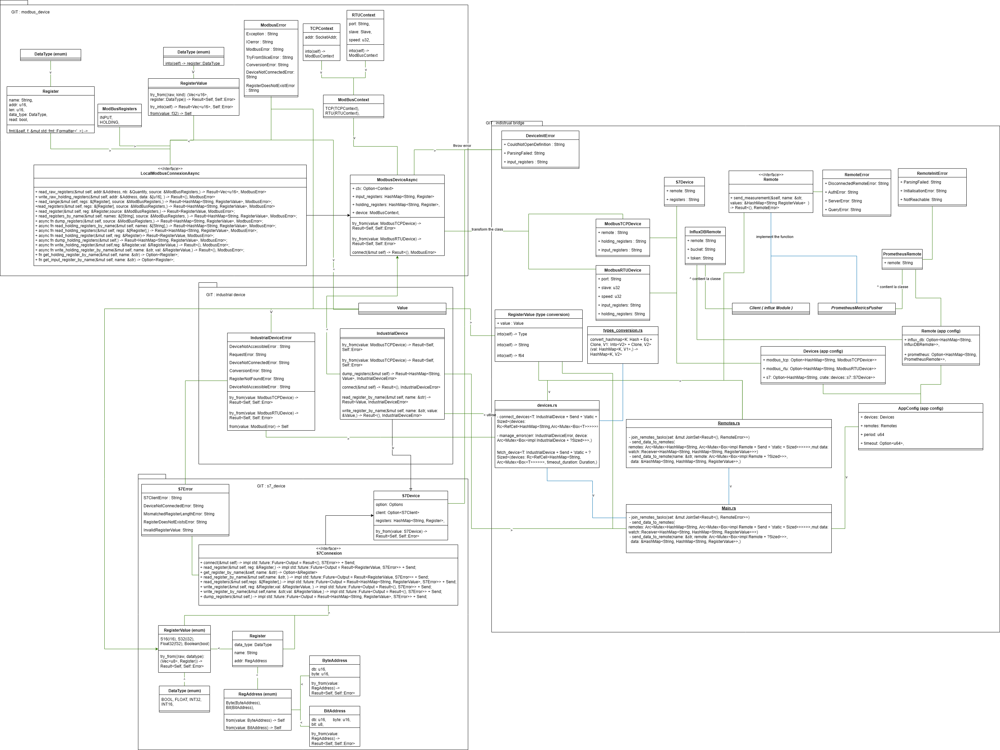

# Developper Documentation

## Detailled diagramm class

## Documentation

To generate a rust documentation, you can just run the command : ```cargo rustdoc --open```
## Nominal execution flow of the project

### Bridge

## Maintenance
For compatibility the playbook use docker-compose as a service manager.

Services configurations can be found in the user home in the folder defined by the `folder` variable (default `/home/<user>/station_control`). With a folder for each service.

Log can be viewed with `docker-compose logs` while in the service folder.

Started services can be viewed with `docker ps`.

Services can be started/stopped with `docker-compose up`/`docker-compose down`.

# Testing
To create a test environment for this project see more informations at [Testing.md](tutorials/Setup_Testing.md).
