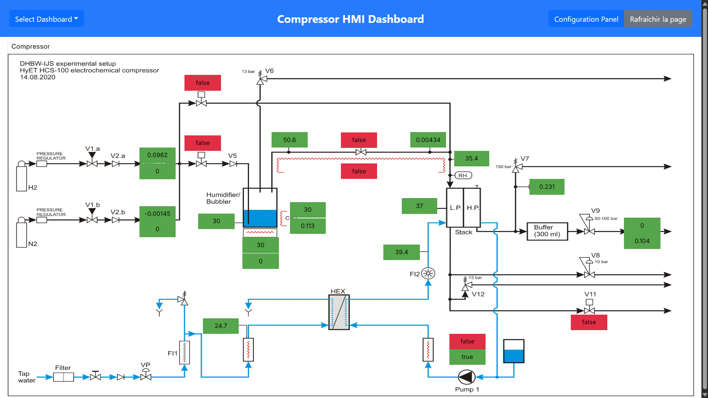
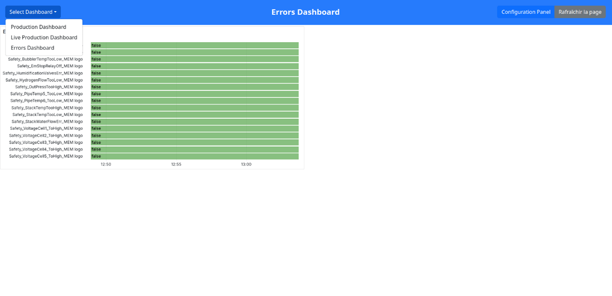
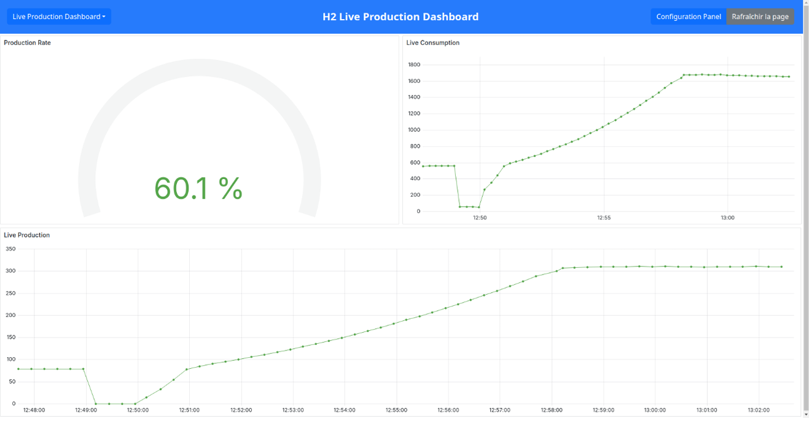
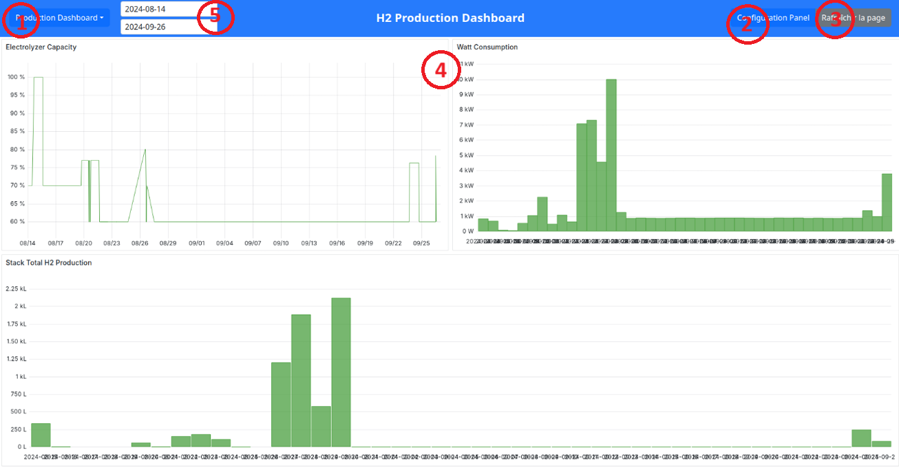
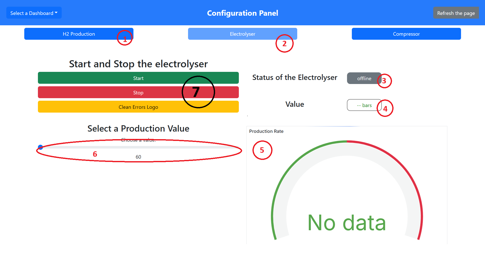
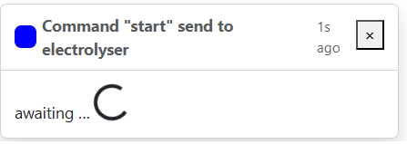

# Project H2Lab

## Summary
- [Goal](#goal) : Initial goal of the project
- [Component](#component) : all the main component of the project
- [Architecture](#architecture) : Simple representation of the architecture of the project
- [WebUI](#webui) : presentation of the web user interface
- [Deployement](#deployement) : description of the step to deploy the project

## Goal
Currently, DHBW purchases bottled hydrogen at a high cost. With the
equipment necessary for on-site hydrogen production now available, the H2Lab Production project aims
to integrate these components to provide a reliable and autonomous hydrogen supply. This application
is primarily intended for DHBW laboratory staff and researchers who require hydrogen for experimental
purposes. The main general objectives of the H2Lab Production project are as follow:
- Automate the operation and coordination of all components of the hydrogen system.
- Acquire and display operational data in real time to monitor performance and safety.
- Integrate a storage and distribution system for the compressed hydrogen produced on site.
## Component
The project is currently in the pilot phase, with the following main components installed
### Electrolyser
An electrolyzer EL41 supplied by Enapter (Italy), capable of producing 500 NL/h of hydrogen, accompanied by a water tank module integrated into an enclosure manufactured by
Ostermeier H2ydrogen Solutions GmbH (Germany).

For seamless integration, the system employs the Modbus protocol, a widely adopted standard in industrial automation.

### EHC
An electrochemical hydrogen compressor (EHC) from HyET Hydrogen (Netherlands).

The compressor is programmed with Siemens PLC, and the compressor code uses the S7 protocol for communication.

### Logo

A Siemens Logo!8 who is an entry-level programmable logic controller (PLC) designed for simple automation tasks.

LOGO! acts as the system's orchestra conductor, so it coordinates all the automated operations and supervises the security protocols. Based on requests from the web interface, it launches the various devices and continuously monitors the overall state of the system. In the event of a fault, it triggers an emergency stop and sends an immediate alert to the website to report the error.

## Architecture


## WebUI
The second essential component project is the Web User Interface (WebUI). It is the system’s user entry
 point and enables :
 • view the data collected by the industrial bridge in real time,
 • check the various components of the production bench

The Web user interface is organized into five functional modules.

### Modules

**Webui Production dashboard** (*ProductionDashboard.html*)
  
The Production dashboard consolidates production history and power consumption data.
You can see three graph representing the capacity of the electrolyser, the Watt Consumption of the system and the H2 production from the stack of the compressor.

**Webui Compressor HMI dashboard** (*CompressorHMIDashboard.html*)

A module replicates the Human Machine Interface of the compressor, offering direct access to its functionalities.

**Webui Errors Dashboard** (*ErrorsDashboard.html*)

the error panel centralizes diagnostic information related to both the compressor and the electrolyzer.

**Webui Live Production** (*LiveDashboard.html*)

The live production dashboard provides real-time monitoring of hydrogen production.

**Webui configuration Panel** (*ConfigurationPanel.html*)

The configuration panel allows system control, including start/stop commands, clean the error on the logo, and adjustment of the electrolyzer production rate.


### Interaction
To see every interaction on the webUI, we will describe them throught 2 mains page, the production dashboard, and the control panel software
#### Common to each page

The element 1,2,3,4 are common to each page.
1,2,3 compose the header of all the page and 4 is the body of the page with a graph or other elements.
- 1 : it represent the navigation menu. By clicking on it, a drop menu will appear, you can then choose to which dashboard you want to go.


- 2 : it is a button to directly access to the control panel page.
- 3 : the refresh button, as his name says, it will refresh the current page.
- 4 : it is the body of the page and contains graph or other element.

#### Production dashboard
- 5 : it is an input for this page. It let's you choose the interval of the date for the element you want to see in this interval.

#### Control panel



- 1,2 : these button represent the devices that we want to control. the buttons 1 in blue represent the devices we can select. the button 2 in light blue is the one selected.
- 3 : you can not interact with it but it represent the current state of the system
- 4 : The value of the production of hydrogen of the system. By putting you mouse to the element, you can the see difference with the previous value.
- 5 : a visual representation of the production rate setting of the electrolyser.
- 6 : a range input used to change the value of the production rate setting of the electrolyser
- 7 : these three button send the command to start or stop the current device we are on. when you click on it, a pop up appears to keep a trace of the command send and it's status. The button "clean Errors Logo" clean the Error state of the Logo that appears when an error occurs and stop the system from start again.



# Deployement

### Requirements
> The playbook as been tested on debian 12 but should work on any derivatives without too much modifications.

- You need one computer to deploy the H2f control software on the server.

- The Computer need to have a linux terminal. From a Windows, you have two possibility :
    - Run a linux system environnement via a dual boot (Debian, Unbuntu, etc..)
    - Run a linux terminal via [WSL](https://learn.microsoft.com/en-us/windows/wsl/install)

In last case, a thin docker wrapper around ansible is provided. See [running using docker](tutorials/Running_Docker.md)


- You should have access to the server via ssh, for security and convenience it is recommanded to setup key-based authentification. See [Setup_SSH.md](tutorials/Setup_SSH.md)

> Your user should have superuser access via sudo (for doas add `--become-method=doas` when invoking ansible)

- Network setup with outside remotes and local devices (WiFi authentification, IP assignement, USB authorisation, ...) has to be done according to your installation prior to running this playbook (See [network-setup.md](/docs/network-setup.md) for more information).
> :warning: Make sure to reflect your installation in the configuration ([bridge_config](https://github.com/lkzjdnb/bridge_config)).


## Setup

```bash
# Download the playbook
git clone https://github.com/lkzjdnb/H2F_control_deploy.git
# Go to the directory
cd H2F_control_deploy
```
Add the remote to the `inventory/hosts` file :

```nginx
remote_name ansible_host=<remote_url> ansible_ssh_user=<username> ansible_ssh_pipelining=False ansible_ssh_private_key_file=<name_of_ssh_file>
```
With :
- remote_name : "laptop"
- ansible_host : ip of the server
- ansible_ssh_user : username of the server
- ansible_ssh_private_key_file

```nginx
# example :
laptop ansible_host=192.168.1.3 ansible_ssh_user=client ansible_ssh_pipelining=False ansible_ssh_private_key_file=ssh_key
```

Create configuration for the remote in the file `inventory/host_vars/<remote_name>/vars.yml` setting variables (see the example for help) : 
```nginx
# file organisation tree
- H2F_control_deploy
|
-- inventory
|
--- host_vars
|
---- laptop
|
----- vars.yml

# content of vars.yml

---
folder: station_control
domain: H2F

influx_pass: ExamplePassword

influx_migrate_file:
  - backup.lp.gz
```

## Migrating from previous installation
To import data from an other influxDB installation : [Migrating.md](tutorials/Migrating.md)
If you don't have any data, remove backup.lp.gz file reference in `vars.yml`

## Deployement
> Because Ansible support on Windows is not easy, a thin docker wrapper around ansible is p
> rovided. See [running using docker](tutorials/Running_Docker.md)

To run the playbook you shoud have the ssh_key file and the database backup file at the root of the project (/H2F_control_deploy)
Run the playbook, this will install and setup all service. And can take a few minutes (30 mins) to finish : 
`ansible-playbook -v -i inventory/hosts playbook.yaml --tags "install-all"`


### Accessing the interface
Depending on graphics support of the server, the interface may be accessible.
Otherwise you can access it directly on the computer : 
- Add the hostname to your host registry (/etc/hosts on linux, /Windows/System32/drivers/etc/hosts on windows):
```nginx
# Static table lookup for hostnames.
# See hosts(5) for details.

127.0.0.1	localhost
::1		localhost
+<server ip> webui.h2f
+<server ip> grafana.h2f
+<server ip> influx.h2f
```
### Testing
If everything went correctly the interface should have started and you should now be able to access the services : 
- Grafana at http://grafana.<hostname>
- InfluxDB at http://influx.<hostname>

- The webUI at http://webui.<hostname>
